# SOCA Control — User Guide

**soca-control** is the Central Fleet Dashboard. It aggregates detection events, alerts, and live streams from all edge nodes (soca-dashboard instances) into one central view. Use it for fleet-wide monitoring, compliance reporting, and system administration across multiple sites.

URL: `http://<control-server>:8000`

---

## 1. Logging In

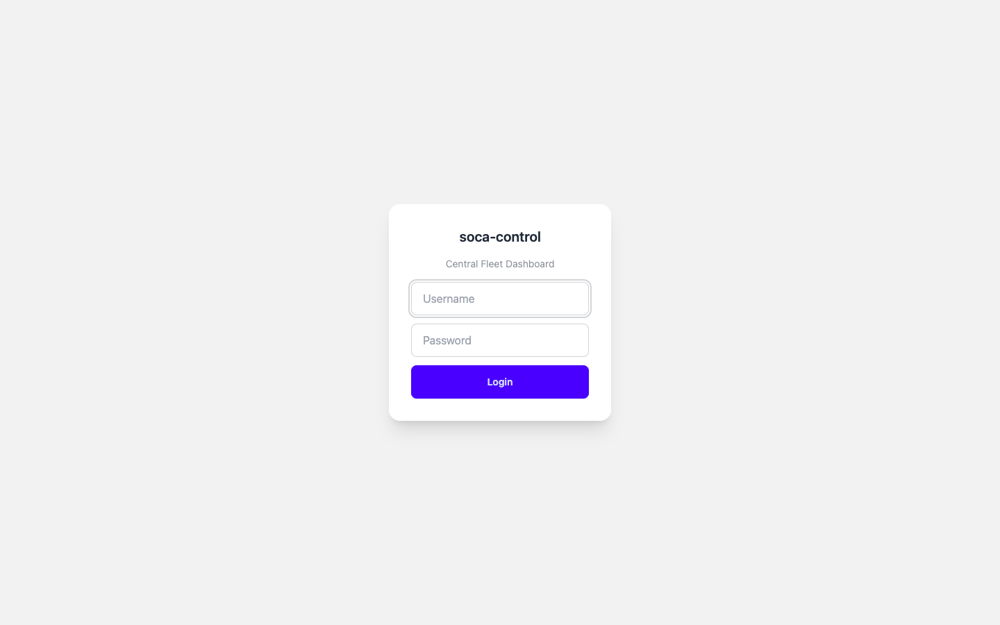

Enter your username and password, then click **Login**. The system supports two roles:

| Role | Access |
|------|--------|
| **Admin** | Full access — dashboard, live streams, assets, reports, settings, users |
| **Viewer** | Read-only — dashboard, live streams, assets, reports |

---

## 2. Dashboard

After login you land on the **Dashboard** — the command centre for all edge nodes.

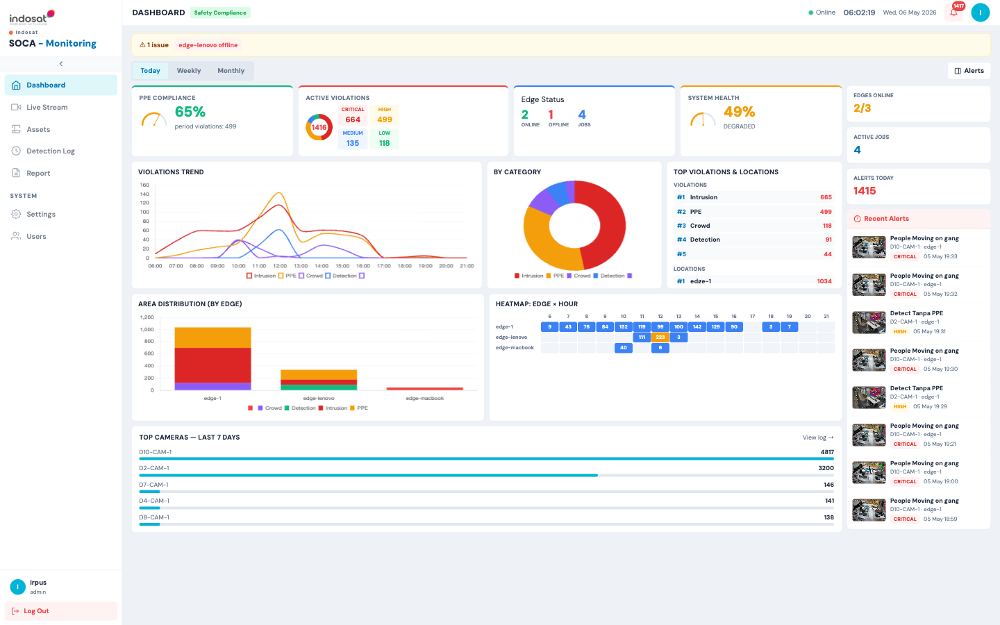

### Top Bar

| Element | Description |
|---------|-------------|
| Status dot (green/red) | Real-time connection to soca-service backend |
| Clock | Current server time |
| Bell icon | Alert notification count — click to view recent alerts |

### Summary Widgets

| Widget | Description |
|--------|-------------|
| **PPE Compliance** | Compliance rate as a percentage with period violation count |
| **Active Violations** | Total violations broken down by severity: Critical, High, Medium, Low |
| **Edge Status** | Number of online / offline edges and total active jobs |
| **System Health** | Aggregate health percentage across all edges |

### Right Panel — Quick Alerts

A live feed of the latest detection events across all edges. Each entry shows a snapshot thumbnail, rule name, camera, edge, severity badge, and timestamp.

### Charts

| Chart | What it shows |
|-------|--------------|
| **Violations Trend** | Hourly violation counts by category (Intrusion, PPE, Crowd, Detection) |
| **By Category** | Donut chart — proportion of each violation type |
| **Top Violations & Locations** | Ranked list of violation types and most-affected edge locations |
| **Area Distribution (by Edge)** | Stacked bar chart — violation volume per edge, split by category |
| **Heatmap: Edge × Hour** | Colour-coded grid — when each edge generates the most events |
| **Top Cameras — Last 7 Days** | Bar chart of cameras ranked by total detection events |

### Time Filter

Switch between **Today**, **Weekly**, and **Monthly** views using the tabs at the top of the chart area.

> **⚠ Edge offline banner** — if an edge goes offline, a warning banner appears at the top of the dashboard.

---

## 3. Live Stream

**Live Stream** shows real-time video feeds aggregated from all connected edge nodes.

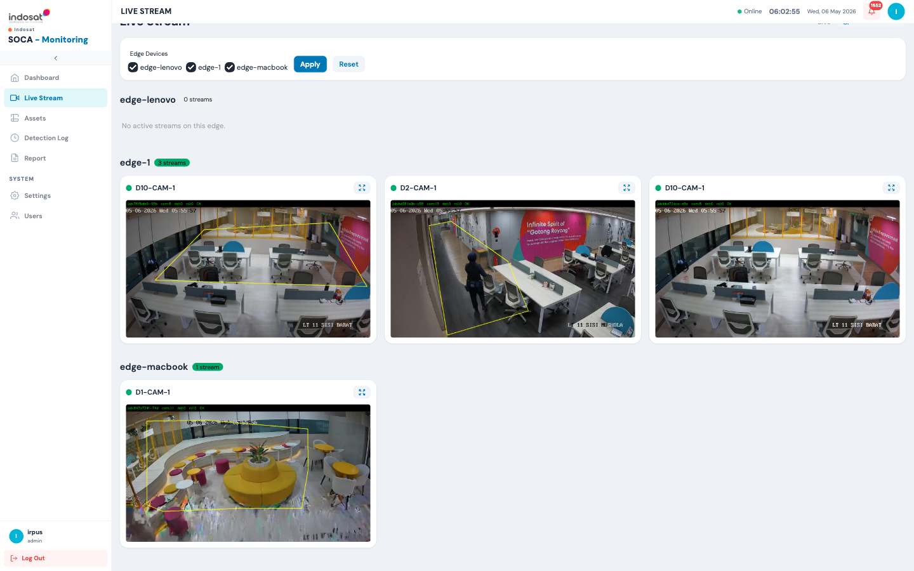

### Filtering by Edge

Use the **Edge Devices** checkboxes at the top to show or hide streams from specific edges. Click **Apply** to filter, **Reset** to show all.

### Stream Cards

Each card shows:
- Camera name and edge label
- Live video frame with detection overlays (ROI polygon, bounding boxes)
- Green dot = stream is active

Click the **expand icon** (⤢) on any card to open the stream in full-screen view.

Edges with no active streams show a "No active streams on this edge" message.

---

## 4. Assets

**Assets** provides a fleet-wide inventory of all cameras across all edge nodes.

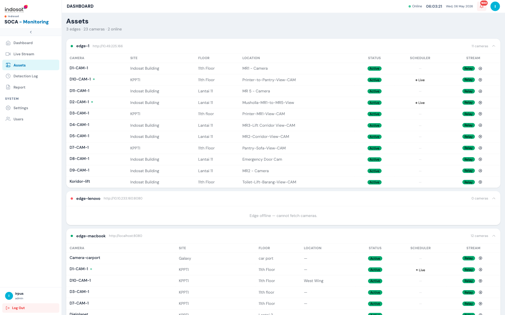

For each edge the list shows:
- Edge name and URL
- Online/Offline status (green/red dot)
- For each camera: Name, Site, Floor, Location, Status, Scheduler state, Stream type

| Column | Description |
|--------|-------------|
| **Status** | Active / Inactive — pulled live from the edge |
| **Scheduler** | Whether a detection job is running (`• Live` = active job) |
| **Stream** | Relay = streamed via mediamtx relay; click the ⓘ icon for the stream URL |

> Offline edges display "Edge offline — cannot fetch cameras" and cannot be managed until reconnected.

---

## 5. Detection Log

**Detection Log** is the unified event log for all edges — every detection event from every camera in one place.

Access via the sidebar: **Detection Log**

Columns include: Timestamp, Edge, Camera, Rule, Category, Message, Violation labels, Count, and a Snapshot thumbnail.

Filter controls at the top allow narrowing by edge, camera, date range, category, and free-text search.

---

## 6. Reports

The **Report** section provides dedicated analytics pages per detection category. All reports support CSV export and can be filtered by edge, camera, and date range.

### 6.1 Intrusion Report

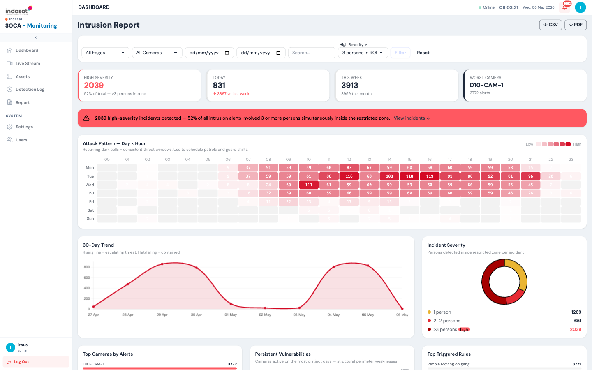

| Widget | Description |
|--------|-------------|
| **High Severity** | Events where ≥3 persons were detected simultaneously in the restricted zone |
| **Today / This Week** | Rolling counts with week-on-week comparison |
| **Worst Camera** | Camera with the highest alert count |
| **Attack Pattern — Day × Hour** | Heatmap identifying recurring intrusion windows — use to schedule patrols |
| **30-Day Trend** | Rising line = escalating threat; falling = contained |
| **Incident Severity** | Donut — breakdown by 1, 2–2, and ≥3 persons per incident |
| **Top Cameras by Alerts** | Ranked list |
| **Persistent Vulnerabilities** | Cameras active on most distinct days — structural weaknesses |
| **Top Triggered Rules** | Which detection rules fire most often |

Export options: **↓ CSV** and **↓ PDF** (top-right).

### 6.2 PPE Compliance Report

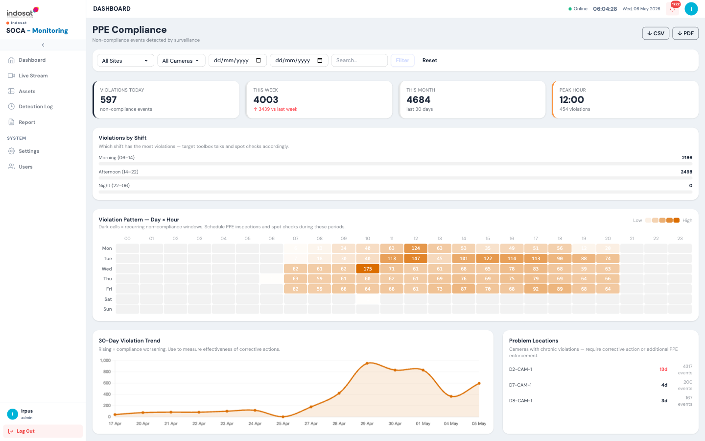

| Widget | Description |
|--------|-------------|
| **Violations Today / This Week / This Month** | Rolling counts |
| **Peak Hour** | Hour of day with the most PPE violations |
| **Violations by Shift** | Morning (06–14), Afternoon (14–22), Night (22–06) — target toolbox talks accordingly |
| **Violation Pattern — Day × Hour** | Heatmap of recurring non-compliance windows |
| **30-Day Violation Trend** | Rising = compliance worsening |
| **Problem Locations** | Cameras with chronic violations — persistent offenders |
| **Daily Summary** | Per-day count with recommended action (Monitor / Corrective action) |
| **Violation Log** | Paginated event log with site, camera, rule, violation label, message, and evidence thumbnail |

### 6.3 Crowd Detection Report

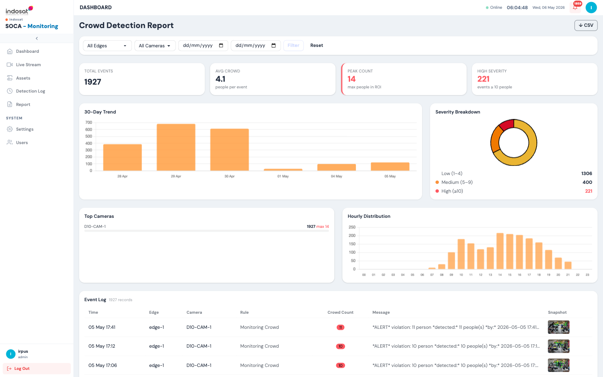

| Widget | Description |
|--------|-------------|
| **Total Events** | All crowd detection events in the period |
| **Avg Crowd** | Average people per detection event |
| **Peak Count** | Maximum simultaneous people detected in ROI |
| **High Severity** | Events with ≥10 people |
| **30-Day Trend** | Bar chart of daily crowd events |
| **Severity Breakdown** | Donut — Low (1–4), Medium (5–9), High (≥10) |
| **Top Cameras** | Ranked by event count with peak count |
| **Hourly Distribution** | Bar chart — when crowd events peak during the day |
| **Event Log** | Time, Edge, Camera, Rule, Crowd Count, Message, Snapshot |

### 6.4 License Plate Recognition (LPR) Report

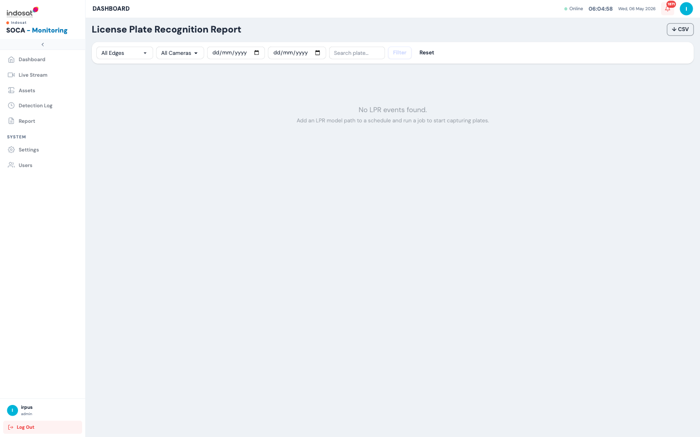

Displays all captured license plate events. Filter by edge, camera, date range, or search for a specific plate number.

> If no LPR events are shown, ensure a schedule has an **LPR Model Path** configured and the job is running.

Export: **↓ CSV**

### 6.5 People Counting Report

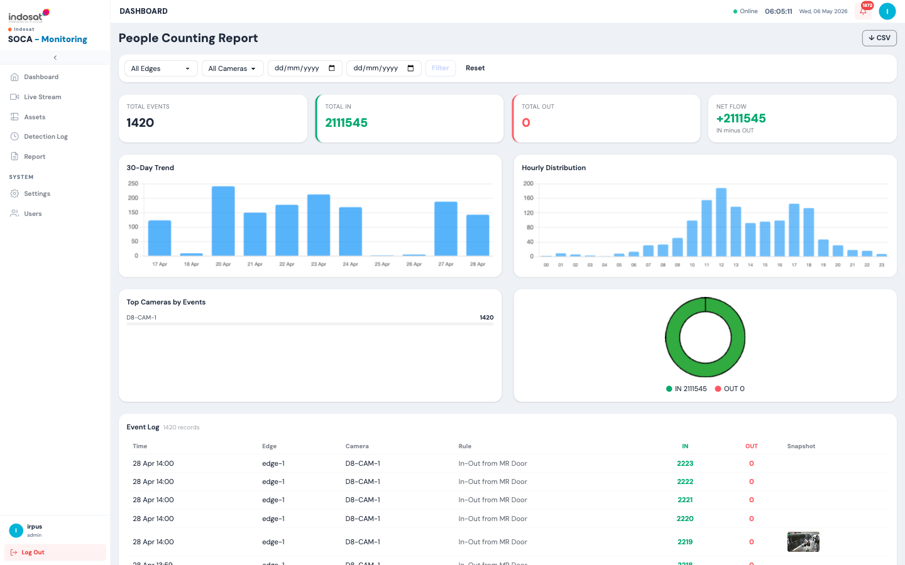

| Widget | Description |
|--------|-------------|
| **Total Events** | Number of crossing-line events |
| **Total IN / OUT** | Cumulative people counted entering and leaving |
| **Net Flow** | IN minus OUT — net occupancy change |
| **30-Day Trend** | Daily event bar chart |
| **Hourly Distribution** | When foot traffic peaks |
| **Top Cameras by Events** | Ranked list |
| **Event Log** | Time, Edge, Camera, Rule, IN count, OUT count, Snapshot |

Export: **↓ CSV**

---

## 7. Settings

**Settings — CV Control Plane** provides system-level configuration for the control server.

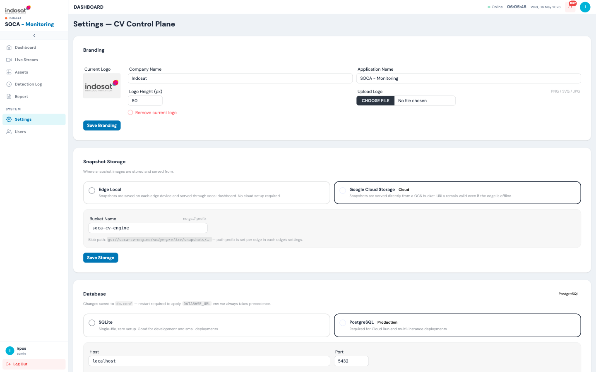

| Section | Purpose |
|---------|---------|
| **Branding** | Change company name, application name, and logo |
| **Snapshot Storage** | Choose where alert snapshots are stored: Edge Local (served through each soca-dashboard) or Google Cloud Storage (GCS bucket, always accessible even when edge is offline) |
| **Database** | Switch between SQLite (dev/small deployments) and PostgreSQL (production/Cloud Run). Changes require a service restart |
| **Pub/Sub** | Configure Google Cloud Pub/Sub subscription details for receiving detection events from edges |
| **Ingest Key** | Generate and push the ingest API key used by soca-ingest to authenticate event delivery |
| **Edge Nodes** | List of registered edge nodes — edit URL, name, GCS prefix, or delete an edge |
| **Edge Operations** | Per-edge: start/stop individual schedules remotely, trigger local or remote snapshot purges |
| **soca-service** | Configure the path and URL to the soca-service microservice (used for detection log aggregation) |

### 7.1 Configure Snapshot Storage

1. Go to **Settings**.
2. Under **Snapshot Storage**, select **Google Cloud Storage** for cloud deployments.
3. Enter the **Bucket Name** (without `gs://` prefix).
4. Click **Save Storage**.

### 7.2 Register a New Edge

1. In **Settings**, scroll to **Edge Nodes**.
2. Click **Add Edge** and fill in the edge name and dashboard URL (e.g. `http://<edge-ip>:8080`).
3. Configure the GCS snapshot prefix for that edge.
4. Click **Save**.

### 7.3 Remote Edge Operations

1. Go to **Settings → Edge Operations** (or click the operations icon next to an edge).
2. View all schedules on that edge with their current status.
3. Click **Start** or **Stop** next to any schedule to control it remotely.
4. Use **Purge Remote** to delete snapshots from the edge's local storage, or **Purge Local** to remove data from the control database.

---

## 8. Users

**Users** manages who can access soca-control.

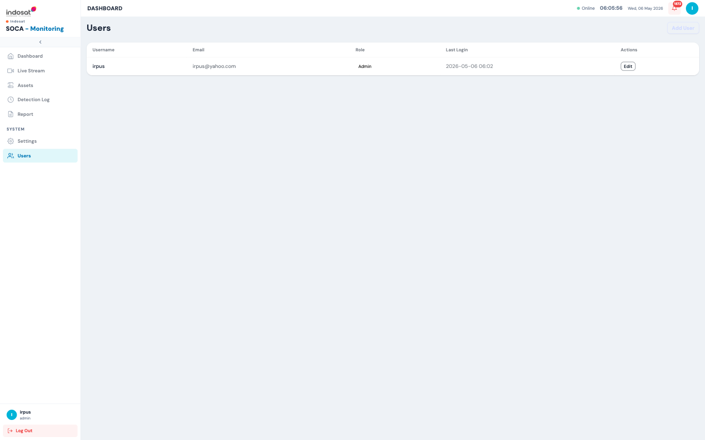

| Column | Description |
|--------|-------------|
| Username | Login name |
| Email | Contact email |
| Role | Admin or Viewer |
| Last Login | Timestamp of most recent session |
| Actions | Edit user details |

### 8.1 Add a User

1. Go to **Users**.
2. Click **Add User** (top-right).
3. Fill in username, email, password, and role.
4. Click **Save**.

### 8.2 Edit a User

Click **Edit** next to any user to update their email, password, or role.

---

## 9. Common Tasks — Quick Reference

| Task | Where |
|------|-------|
| View fleet-wide violation summary | Dashboard |
| Watch live cameras across all edges | Live Stream |
| See which cameras are online | Assets |
| Search all detection events | Detection Log |
| Export intrusion incidents to PDF | Report → Intrusion → ↓ PDF |
| Check PPE compliance by shift | Report → PPE Compliance → Violations by Shift |
| Find peak crowd hours | Report → Crowd Detection → Hourly Distribution |
| Search for a license plate | Report → LPR → Search plate field |
| Measure foot traffic net flow | Report → People Counting |
| Add a new edge node | Settings → Edge Nodes → Add Edge |
| Stop a schedule on a remote edge | Settings → Edge Operations → Stop |
| Change snapshot storage to GCS | Settings → Snapshot Storage → Google Cloud Storage |
| Add a new control user | Users → Add User |

---

## 10. Troubleshooting

| Symptom | Likely cause | Fix |
|---------|-------------|-----|
| Edge shows **offline** in Assets | Edge dashboard unreachable | Check network connectivity to edge URL; verify soca-dashboard is running |
| No events in Detection Log | soca-ingest not delivering events | Check Settings → Ingest Key is correct; verify Pub/Sub subscription is active |
| Live stream shows no video | Edge schedule not running or Enable Monitor is off | Go to that edge's soca-dashboard and start a schedule with Enable Monitor enabled |
| Snapshots not loading in reports | GCS bucket misconfigured | Check Settings → Snapshot Storage bucket name and service account permissions |
| LPR report empty | No LPR-enabled schedules running | Edit a schedule on the edge, set an LPR Model Path, and start the job |
| PPE compliance % seems wrong | Date filter includes periods with no data | Reset the filter or adjust the date range |
| Dashboard shows degraded health | One or more edges are offline or have high error rates | Check Edge Status widget and investigate offline edges in Assets |
