# SOCA Platform — User Guide

SOCA (Security Operations Center Automation) is an AI-powered edge video analytics platform. This guide covers everyday operator tasks across two apps:

- **SOCA Dashboard** (`http://<edge-ip>:8080`) — single-edge management: cameras, detection schedules, live streams, alerts.
- **SOCA Engine** (`http://<edge-ip>:8082`) — the AI inference backend; mostly used via API or the Dashboard push action.

---

## 1. Logging In

Navigate to the Dashboard URL and sign in with your username and password.

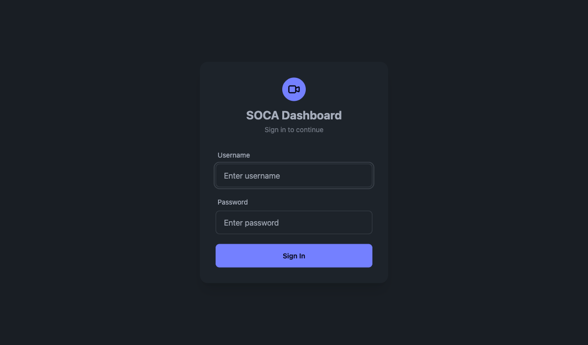

| Role | What they can do |
|------|-----------------|
| **Admin** | Full access: cameras, schedules, settings, user management |
| **Operator** | Cameras, schedules, alerts — no user/system settings |
| **Viewer** | Read-only: dashboard, alerts, live streams |

---

## 2. Dashboard Home

After login you land on the **Dashboard** overview.

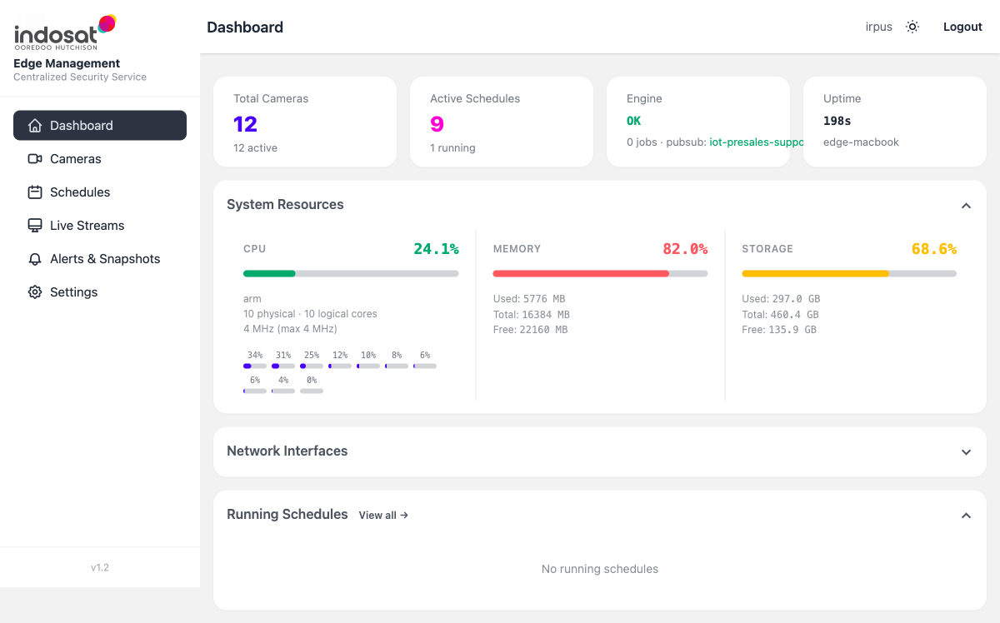

| Widget | Description |
|--------|-------------|
| **Total Cameras** | Number of registered cameras (active/total) |
| **Active Schedules** | Detection schedules marked Active |
| **Engine** | Engine health — OK means the inference service is reachable |
| **Uptime** | Edge host uptime |
| **System Resources** | Live CPU, Memory, and Storage usage |
| **Network Interfaces** | Network adapter list (expand to view IPs) |
| **Running Schedules** | Jobs currently running — click *View all* to go to Schedules |

---

## 3. Cameras

**Cameras → Camera List** shows every registered RTSP source.

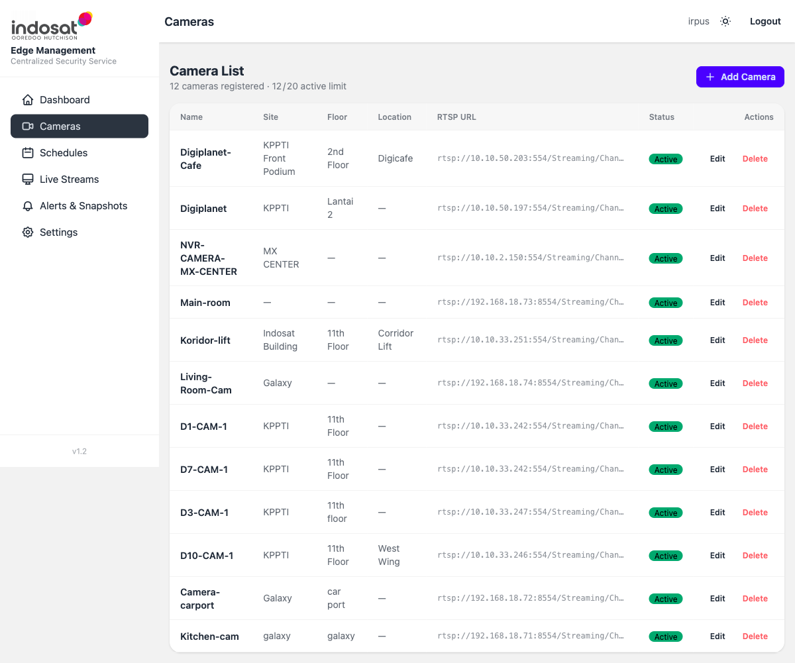

### 3.1 Add a Camera

1. Click **+ Add Camera** (top-right).
2. Fill in the form:

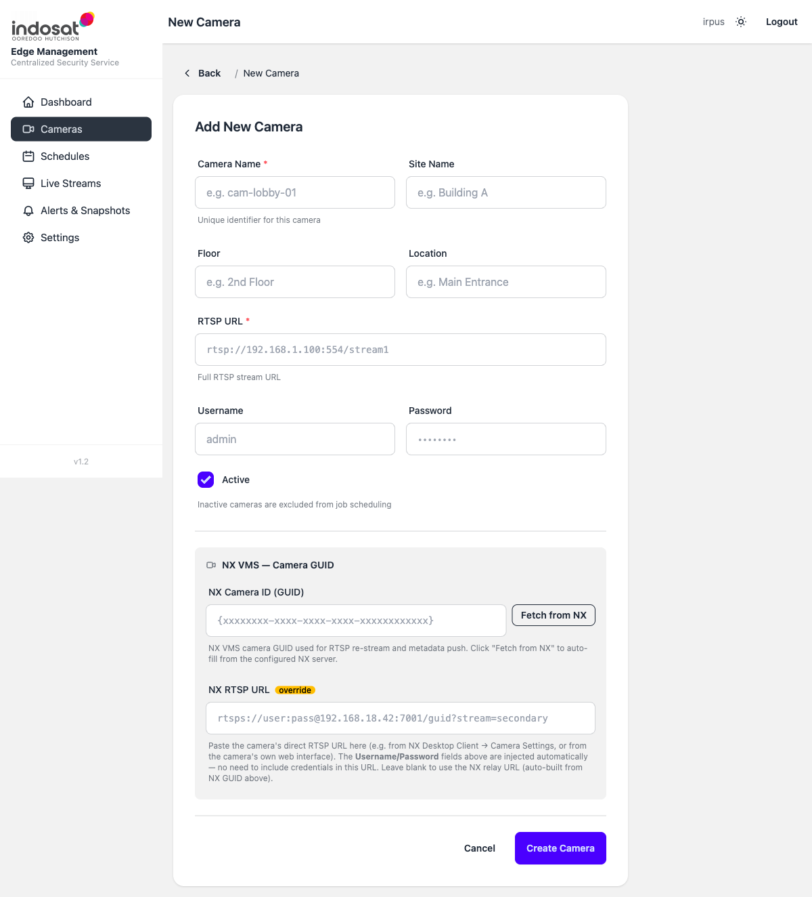

| Field | Required | Notes |
|-------|----------|-------|
| Camera Name | Yes | Unique slug, e.g. `lobby-01` |
| Site Name | No | Building or site label |
| Floor / Location | No | Physical location metadata |
| RTSP URL | Yes | Full stream URL, e.g. `rtsp://192.168.1.100:554/stream1` |
| Username / Password | No | Injected into the RTSP stream automatically |
| Active | — | Uncheck to exclude from scheduling |
| NX Camera ID (GUID) | No | If using NX VMS, click **Fetch from NX** to auto-fill |
| NX RTSP URL | No | Override URL for the NX relay stream |

3. Click **Create Camera**.

### 3.2 Edit or Delete a Camera

From the Camera List, click **Edit** or **Delete** in the Actions column.

> Deleting a camera does **not** stop running jobs — stop any active schedule first.

### 3.3 Test a Snapshot

Click the camera name to open its detail page and request a test snapshot to verify the stream is reachable.

---

## 4. Schedules (Detection Jobs)

A **Schedule** pairs a camera with an AI model and defines when and how to run inference.

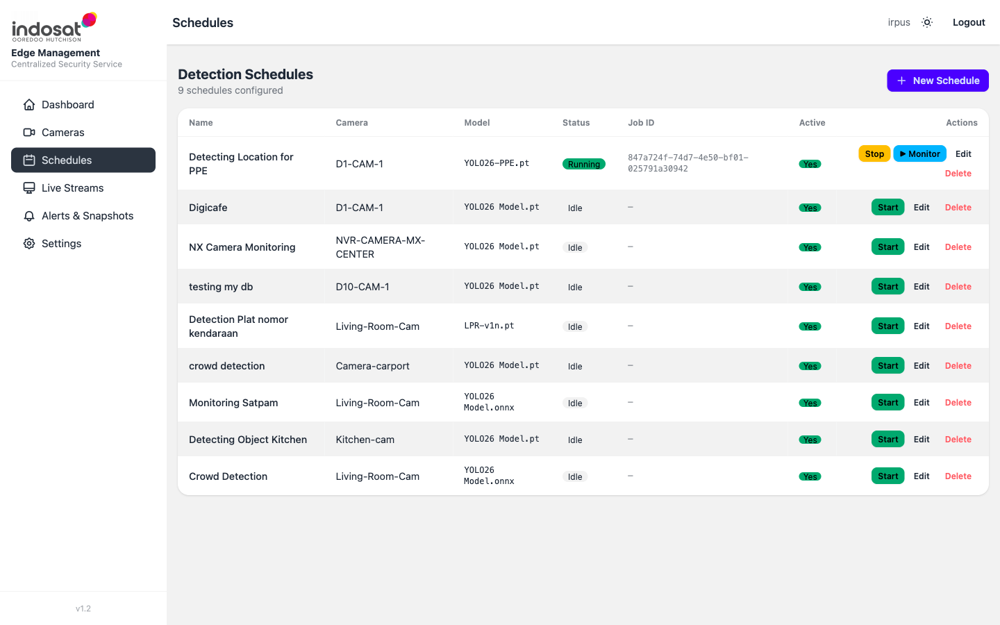

Status values:

| Status | Meaning |
|--------|---------|
| **Idle** | Configured but not running |
| **Running** | Active inference job in progress |
| **error** | Job started but encountered a problem — check engine logs |

### 4.1 Create a Schedule

1. Click **+ New Schedule**.
2. Fill in the form:

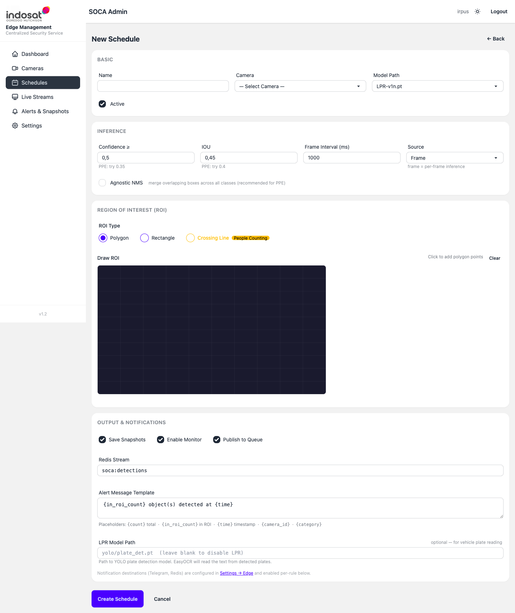

**BASIC section**

| Field | Notes |
|-------|-------|
| Name | Descriptive label, e.g. `Lobby PPE Check` |
| Camera | Select from registered cameras |
| Model Path | AI model file (`YOL026 Model.pt`, `LPR-v1n.pt`, etc.) |
| Active | Uncheck to save without enabling |

**INFERENCE section**

| Field | Default | Notes |
|-------|---------|-------|
| Confidence ≥ | 0.5 | Minimum detection score (0–1). Lower = more detections, more false positives. For PPE try 0.35 |
| IOU | 0.45 | Overlap threshold for NMS. For PPE try 0.4 |
| Frame Interval (ms) | 1000 | How often to sample a frame. Lower = higher CPU usage |
| Source | Frame | `Frame` = per-frame; other modes process video segments |
| Agnostic NMS | off | Enable for PPE models to merge boxes across classes |

**REGION OF INTEREST (ROI)**

Draw the zone where detections should be counted:
- **Polygon** — click points on the canvas to draw a free-form zone
- **Rectangle** — drag a rectangular zone
- **Crossing Line** — for people/vehicle counting across a line (People Counting mode)

Click **Clear** to reset the drawn zone.

**OUTPUT & NOTIFICATIONS**

| Option | Effect |
|--------|--------|
| Save Snapshots | Store a cropped image for each detection event |
| Enable Monitor | Push live frames to the Live Streams viewer |
| Publish to Queue | Forward events to the configured Redis stream |
| Redis Stream | Stream name (default: `soca:detections`) |
| Alert Message Template | Notification text with placeholders (see below) |
| LPR Model Path | Secondary YOLO model for license-plate OCR |

Available template placeholders: `{count}`, `{in_roi_count}`, `{time}`, `{camera_id}`, `{category}`

3. Click **Create Schedule**.

### 4.2 Edit a Schedule & Rules

Click **Edit** on any schedule to open the full edit form.

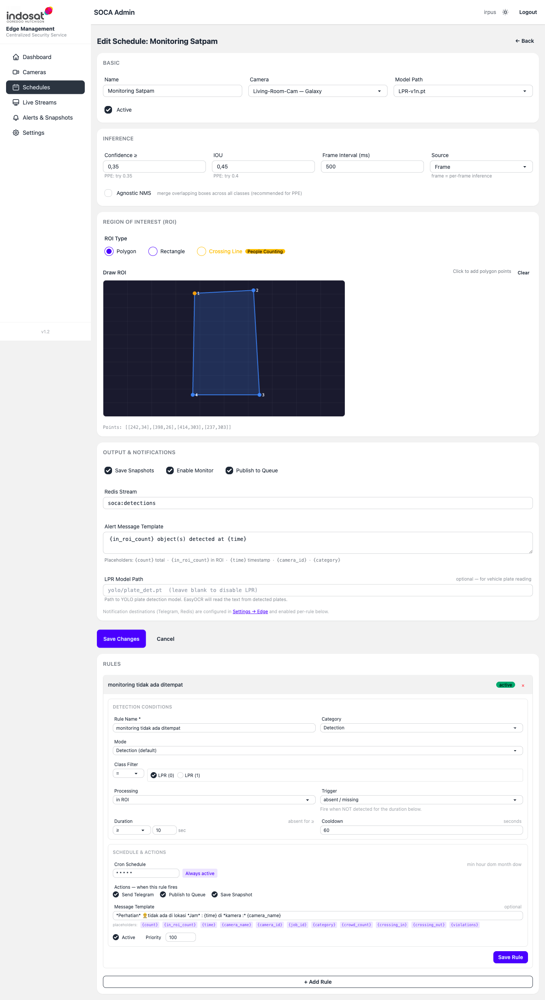

Scroll past the main form to the **RULES** section. Rules fire conditional alerts on top of the base detection:

| Rule field | Notes |
|------------|-------|
| Rule Name | Label shown in alerts |
| Category | `Detection`, `Violation`, `Absence` etc. |
| Mode | `Detection (default)` or specialised modes |
| Class Filter | Limit to specific YOLO classes (e.g. `person`, `car`) |
| Processing | `In ROI` counts only objects inside the drawn zone |
| Trigger | When the rule fires — e.g. `absent / missing` fires when an object is NOT detected |
| Duration | How long condition must persist before firing |
| Cooldown | Minimum seconds between repeated rule firings |
| Cron Schedule | When the rule is active (`* * * * *` = always) |
| Actions | Send Telegram, Publish to Queue, Save Snapshot |
| Message Template | Alert body with placeholders |

Click **Save Rule** to persist, **+ Add Rule** to add another rule, or **×** to remove a rule.

### 4.3 Start / Stop a Job

From the Schedule list, click **Start** to launch inference or **Stop** to halt a running job. The status column updates automatically.

---

## 5. Live Streams (Monitor)

**Live Streams** shows real-time video feeds for schedules that have **Enable Monitor** turned on.

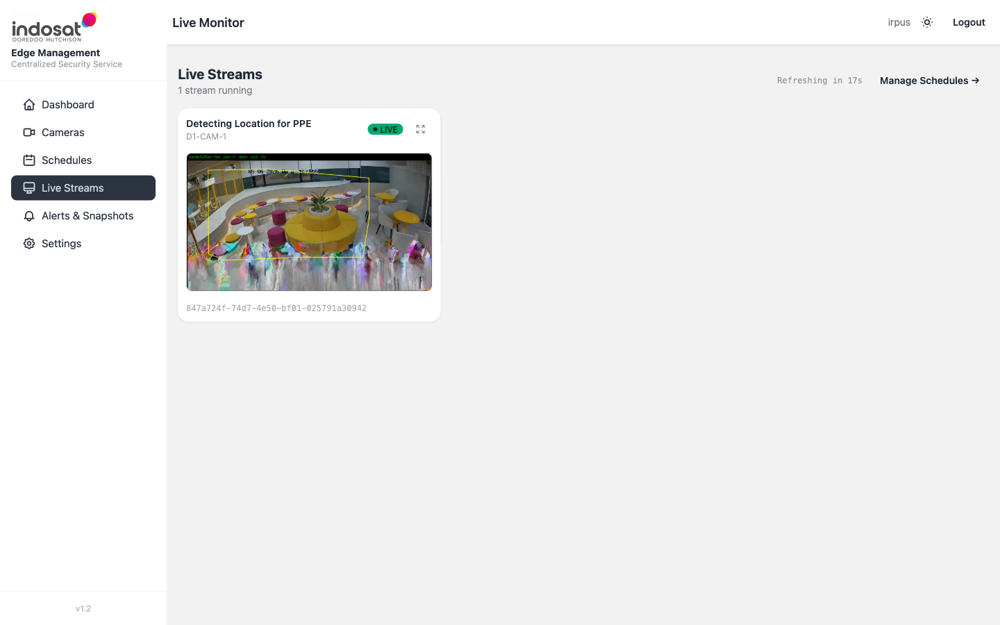

If no streams are shown, make sure at least one schedule is running with *Enable Monitor* enabled. The page auto-refreshes every 30 seconds.

---

## 6. Alerts & Snapshots

**Alerts & Snapshots** is the event log — every detection event that matched a rule appears here.

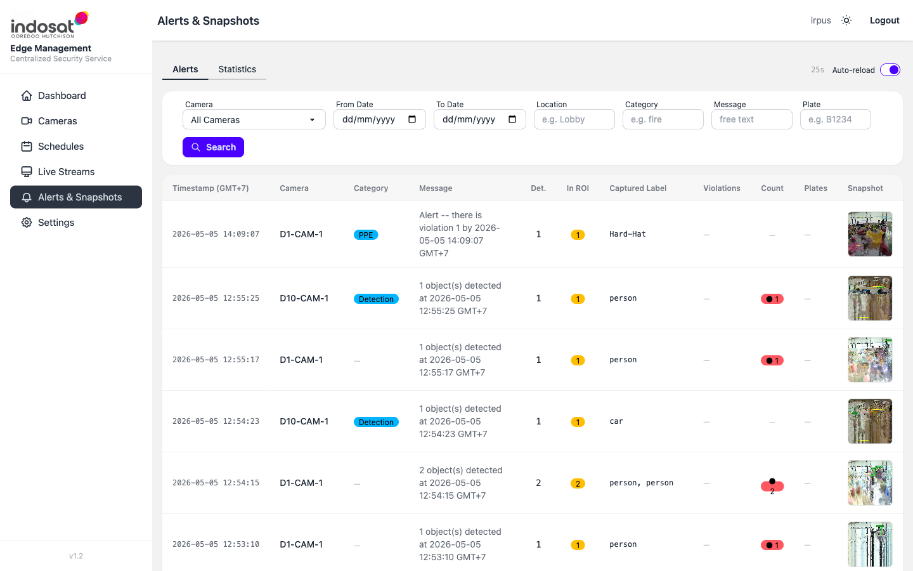

### Filtering

Use the filter bar at the top:

| Filter | Description |
|--------|-------------|
| Camera | Limit to a specific camera |
| From / To Date | Date range in `dd/mm/yyyy` format |
| Location | Text search on location field |
| Category | Alert category (Detection, Violation, etc.) |
| Message | Free-text search on the alert message |
| Plate | Search for a detected license plate number |

Click **Search** to apply. Pagination controls appear at the bottom.

### Statistics Tab

Switch to the **Statistics** tab for aggregated counts and charts grouped by camera or time period.

### Alert Detail

Click any row to open the alert detail, which shows the full snapshot image, bounding boxes, detected labels, and rule that triggered the event.

---

## 7. Settings

**Settings** provides system-level configuration in tabbed sections.

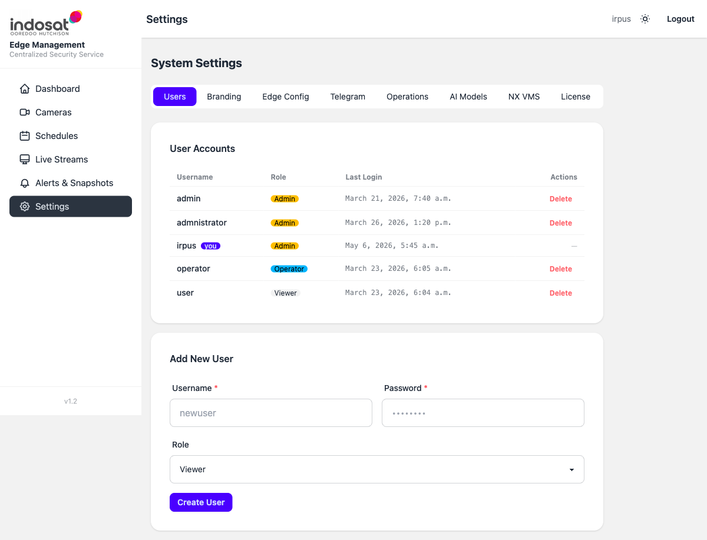

| Tab | Purpose |
|-----|---------|
| **Users** | Add/remove user accounts and assign roles (Admin, Operator, Viewer) |
| **Branding** | Change the site name and logo |
| **Edge Config** | Set edge node identity, API key, engine key, and Pub/Sub topic |
| **Telegram** | Configure Telegram bot token and default chat ID for alert notifications |
| **Operations** | View schedule job statuses, purge old snapshot data |
| **AI Models** | Upload or delete `.pt` / `.onnx` model files used by the engine |
| **NX VMS** | Configure NX server URL and credentials for camera GUID resolution |
| **License** | Activate, refresh or unlink the SOCA platform license |

### 7.1 Add a User

1. Go to **Settings → Users**.
2. Fill in **Username**, **Password**, select **Role**.
3. Click **Create User**.

### 7.2 Push Config to Engine

After changing cameras, schedules, or edge settings, push the latest config to the engine:

1. Go to **Settings → Edge Config**.
2. Click **Push to Engine** — the dashboard sends the full camera and schedule config to the soca-engine API.

### 7.3 Purge Old Snapshots

To free disk space:

1. Go to **Settings → Operations**.
2. Click **Preview** to see how many files will be removed.
3. Click **Execute** to delete snapshots older than the configured retention period.

---

## 8. SOCA Engine API

The engine exposes a REST API at `http://<edge-ip>:8082`. Interactive docs are available at `/docs`.

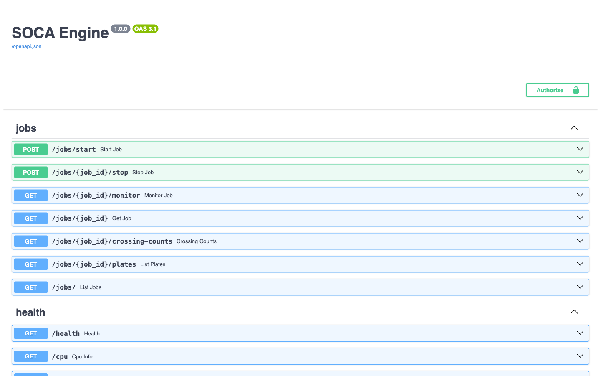

Full endpoint list:

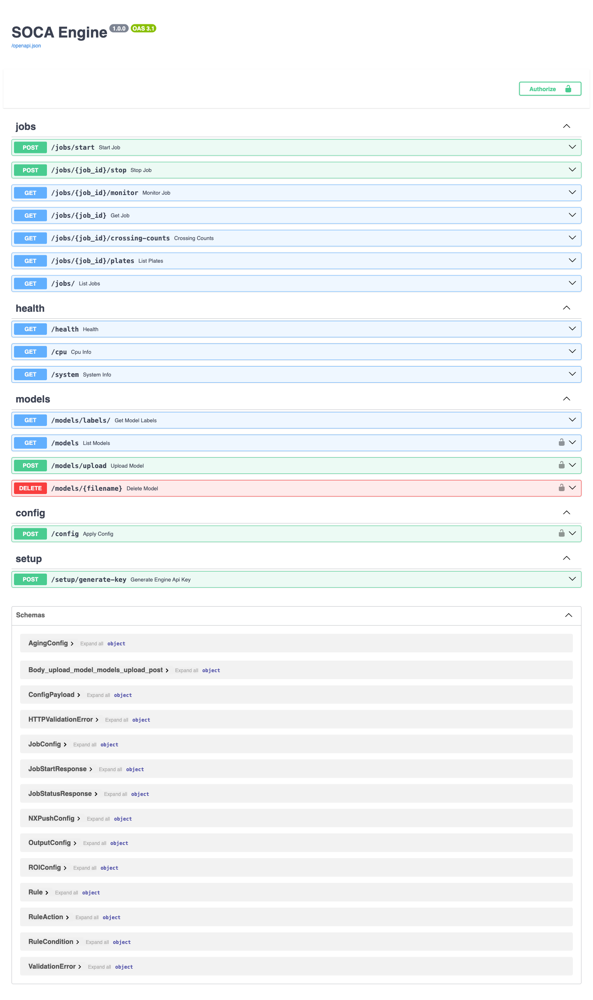

Key endpoint groups:

| Group | Endpoints |
|-------|-----------|
| **jobs** | Start job, Stop job, Get job, Monitor job (WebSocket), List jobs |
| **health** | Health check, CPU info, System info |
| **models** | List models, Upload model, Delete model, Get model labels |
| **config** | Apply config (cameras + schedules pushed from Dashboard) |
| **setup** | Generate engine API key |

Authentication uses an API key header. Generate the key from **Settings → Edge Config → Generate Engine Key** in the Dashboard.

---

## 9. Common Tasks — Quick Reference

| Task | Where |
|------|-------|
| Add first camera | Cameras → + Add Camera |
| Run a detection job | Schedules → Start |
| Watch live video | Live Streams (schedule must have Enable Monitor on) |
| Review detection events | Alerts & Snapshots |
| Add a new user | Settings → Users → Create User |
| Upload a new AI model | Settings → AI Models → Upload |
| Connect to NX VMS | Settings → NX VMS |
| Set up Telegram alerts | Settings → Telegram → configure bot, then add rules to schedules |
| Free disk space | Settings → Operations → Purge |
| Push config to engine | Settings → Edge Config → Push to Engine |

---

## 10. Troubleshooting

| Symptom | Likely cause | Fix |
|---------|-------------|-----|
| Schedule status shows **error** | Engine unreachable or model path wrong | Check Engine status on Dashboard home; verify model file exists in Settings → AI Models |
| Live stream shows "No live streams available" | Schedule not running or Enable Monitor is off | Start a schedule with Enable Monitor checked |
| No alerts appearing | Rule not configured or Confidence too high | Edit the schedule, add a Rule, lower Confidence threshold |
| Camera snapshot fails | Wrong RTSP URL or credentials | Edit camera and test URL with VLC or `ffprobe` |
| Telegram notifications not arriving | Bot token or chat ID wrong | Settings → Telegram → verify token and chat ID |
| Engine shows **Not Found** at `/` | Normal — engine root is not documented | Use `/docs` for the API or `/health` for a health check |
